# 2026 Human Body Generator

A fully procedural, parametric 3D human character generator written in pure
Python + OpenGL. Generates a random humanoid on every run — gender-appropriate
body proportions, face, hair, facial hair, and layered clothing — and plays it
back with either a built-in physics-coherent walk cycle or any BVH motion-capture
file you point it at.

No external character assets, no pre-modelled geometry, no texture files.
Everything — skeleton, skinned mesh, face features, hair, clothes, skin/fabric
shading — is generated procedurally at startup.

---

## Gallery

Every character below is generated procedurally from a random seed. No
modelled meshes, no textures — each pixel is driven by the parametric
pipeline.

|  |  |
|---|---|
| 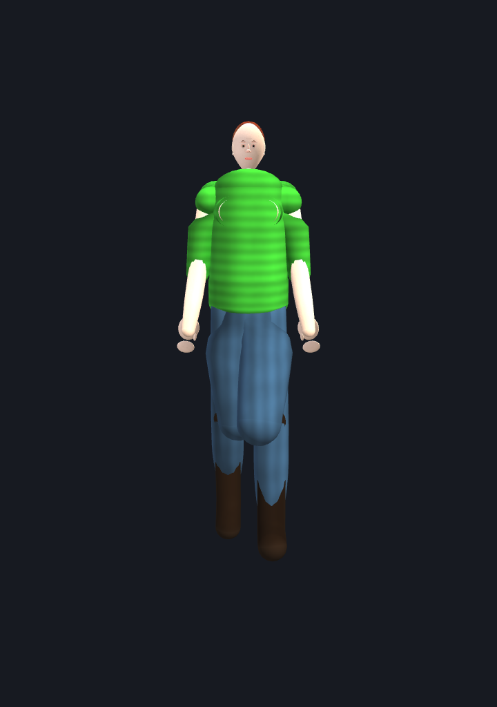  | 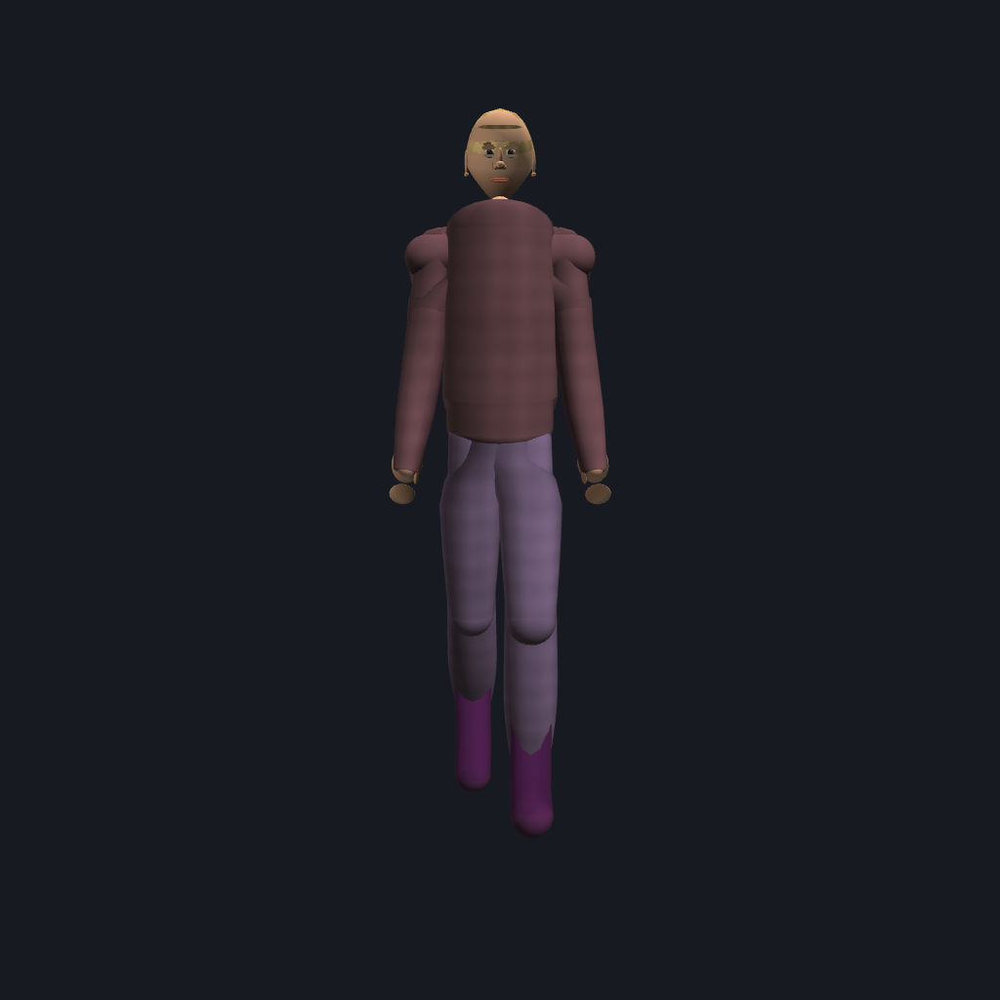 |
| 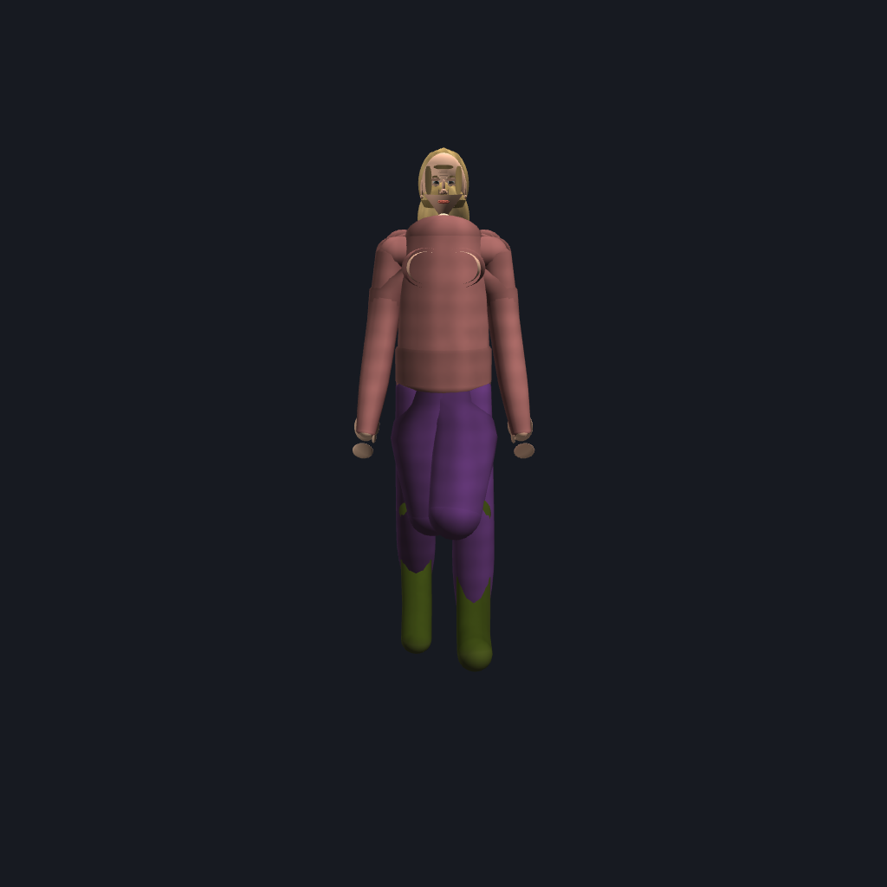 | 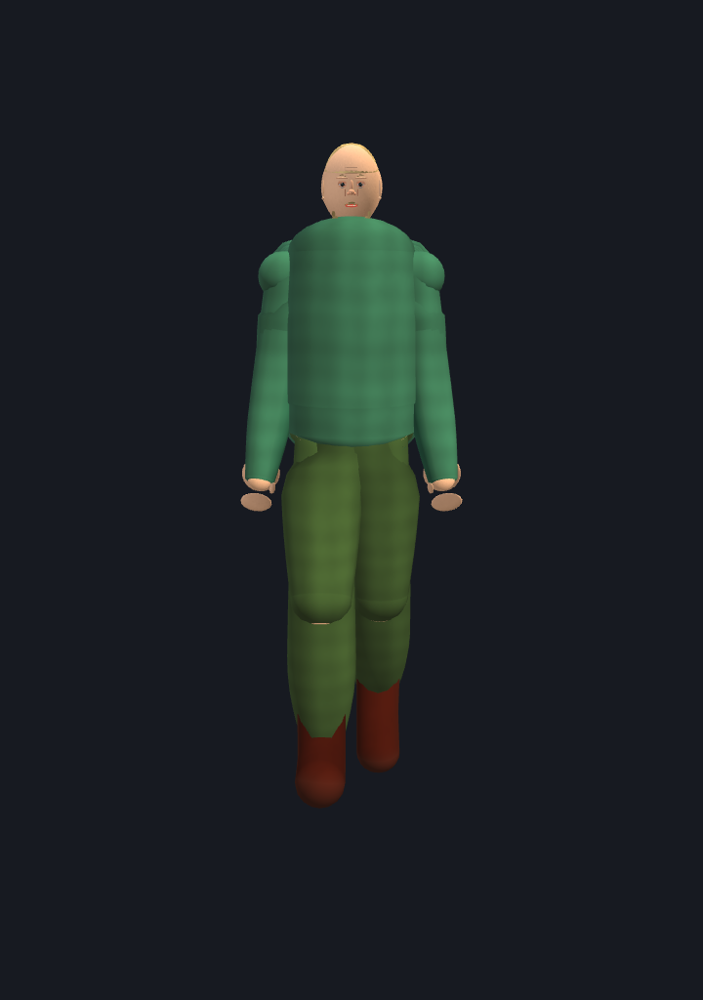 |
| 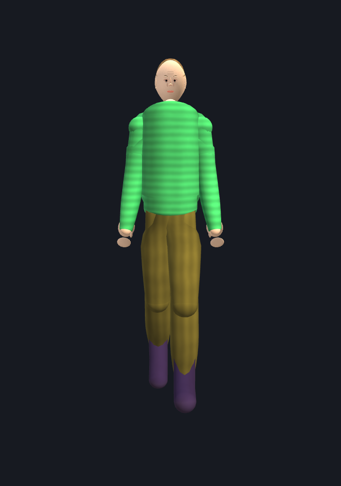        | 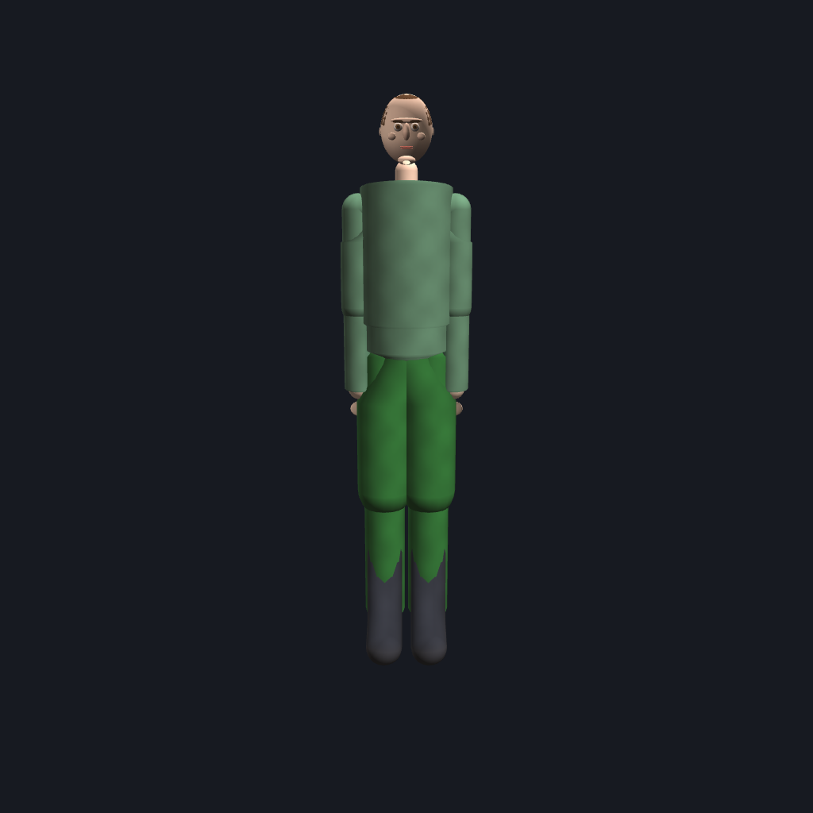 |

### Faces & eyes

Anatomical face stack with expressions, age groups, sub-millimeter face
asymmetry, and a multi-layer eye (sclera + limbal ring + iris + collarette
+ pupil + lacrimal caruncle + corneal catchlight) that converges on the
camera instead of staring parallel.

|  |  |
|---|---|
| 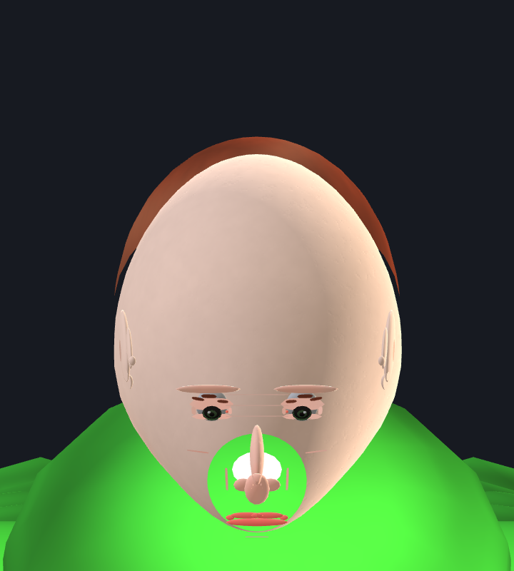  | 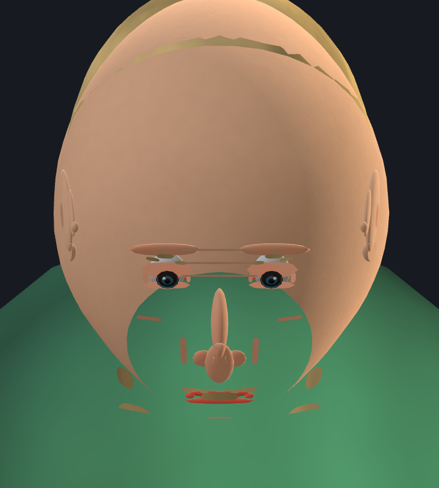 |
| 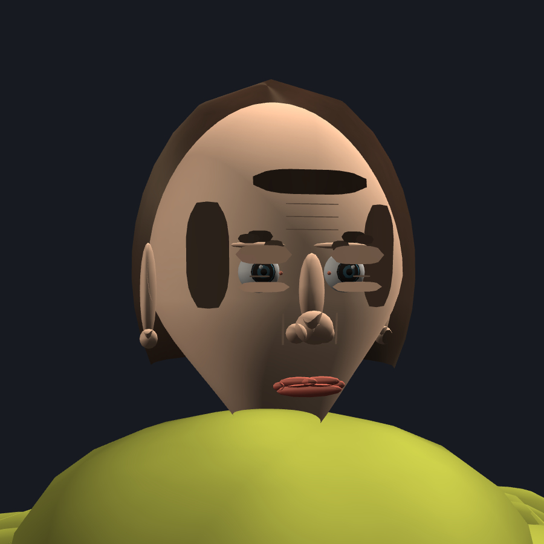 | 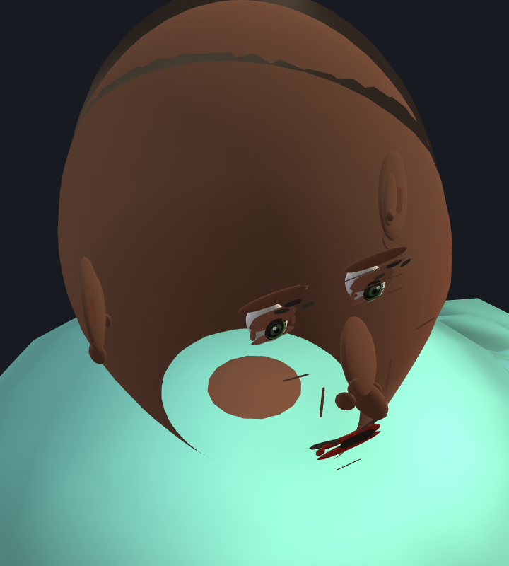 |

### Walk cycle — BVH retargeting

Four frames sampled evenly across `animations/walk2.bvh` (a Mixamo walk),
retargeted onto two different procedurally-generated characters:

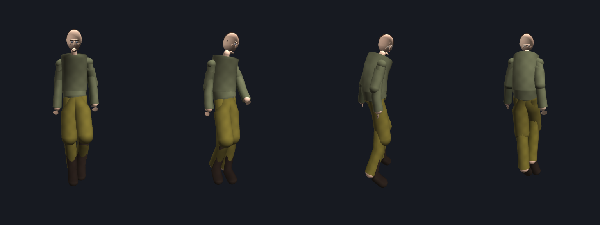
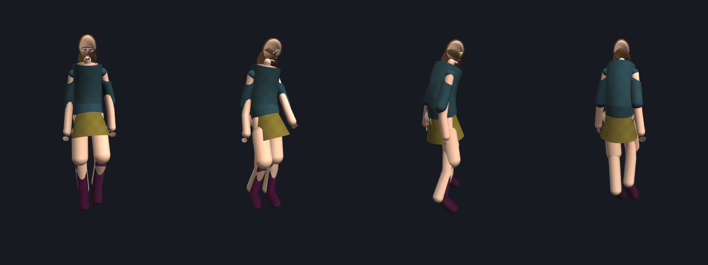

---

## Features

### Parametric body
- 19-bone skeleton laid out on classical anthropometric proportions
  (~7.5 heads tall, shoulder width ~1.7 heads, etc.)
- Per-character `Shape` with SMPL-style gender-conditioned sampling: `height`,
  `bulk`, `limb_len`, `shoulder_w`, `hip_w`, `bust`, `head_size`, `leg_len`,
  `torso_len`
- Female variant adds bust + glutes geometry

### Anthropometric head
- Compound head built from the classical rule-of-thirds landmarks (chin,
  mouth, nose base, eye line, brow, hairline)
- Lips, nose ridge, cheekbones, ears, chin; jaw emphasis for male
- MANO-inspired compound hands with anatomical thumb placement

### Faces — expressions, age, asymmetry
- **Expressions** (`Appearance.expression`): `neutral` / `smile` / `frown`
  / `squint` / `surprised`. Drives both eyelid aperture and lip-corner
  position, plus a vertical mouth-open slide for `surprised`.
- **Age groups** (`Appearance.age_group`): `young` / `adult` / `elder`.
  Adult and elder faces pick up forehead lines, crow's-feet and
  nasolabial folds drawn as thin darker patches over the skull surface;
  young faces stay smooth.
- **Face asymmetry** (`Shape.face_asymmetry`): a small per-character
  left/right radial bias on the skull shell, peaking around the
  cheekbone band. Subliminal at front view, visible at three-quarter.
- **Lip fullness** (`Shape.lip_fullness`): gender-biased multiplier on
  the upper/lower lip radii.
- See `notes/face_system.md`.

### Eyes — anatomical multi-layer stack
- **Spherical eyeball** (true sphere, not an ovoid that reads flat once
  the lids cover the poles).
- **Limbal ring**: dark corneoscleral edge drawn behind the iris — the
  single biggest cue that the iris is a 3D structure rather than a
  printed disc.
- **Iris** with a small forward dome to suggest a corneal bulge.
- **Collarette**: faint inner ring inside the iris (pupillary/ciliary
  zone boundary) so the colored disc isn't a single flat swatch.
- **Pupil** sized at 30 % of the iris (anatomical norm under indoor
  light), perfectly concentric.
- **Lacrimal caruncle**: small flesh-pink bump at the medial canthus,
  tinted off the character's skin tone.
- **Corneal catchlight**: a small bright speck on the upper-outer iris
  of each eye, faking a single off-axis light source — stops the eyes
  reading as dead glass.
- **Gaze convergence**: each iris/pupil is toed inward by a similar-
  triangles convergence shift derived from a 50 cm focal target, so both
  optical axes meet on the camera instead of staring parallel into
  infinity. Eliminates the wall-eye reading and prevents skull
  asymmetry from tipping the brain toward registering exotropia.
- **Sclera tonal jitter** per character so a crowd doesn't share one
  identical pure-white eye.
- All offsets factored through a single `_eye_metrics()` so every layer
  stays concentric and identically converged. See `notes/eye_realism.md`.

### Facial animation — ARKit-52 / FACS-aligned rig
- Standardized on Apple's 52-channel **ARKit blendshape** spec, the
  industry-de-facto facial-animation API also used by Epic MetaHumans,
  Live Link Face, NVIDIA Audio2Face and most face-tracking SDKs.
  Channels are FACS-coded (Ekman & Friesen 1978) so the rig speaks the
  same language as the academic literature.
- `human/face_anim.py` defines the 52 canonical channel names,
  FACS-coded named presets (Ekman six + Duchenne smile + contempt +
  visemes), `FaceRig.resolve()`, regional muscle activation helpers and
  a `FaceClip` keyframe interpolator.
- Each ARKit weight modulates a parameter of the matching parametric
  primitive: `eyeBlink*` -> upper-lid Y, `cheekSquint*` -> lower-lid
  raise (Duchenne marker), `eyeLook*` -> per-eye iris/pupil offset,
  `mouthSmile*`/`mouthFrown*` -> per-side corner Y, `jawOpen` -> lip
  separation, `mouthPucker`/`mouthFunnel` -> lip ring squeeze, etc.
- Per-side channels keep asymmetry first-class: contempt, wink,
  single-side brow flash, asymmetric anger all fall out for free.
- ARKit weights are also mapped into real-time muscle-region signals
  (zygomaticus/risorius/depressor groups, orbicularis oculi/oris,
  nasalis/levator labii and jaw/chin tension) so deformation stays tied
  to plausible anatomical regions instead of arbitrary surface motion.
- `Appearance.expression` (legacy named preset) and the new
  `Appearance.blendshapes` dict layer cleanly: e.g.
  `expression="smile", blendshapes={"eyeBlinkLeft": 1.0}` gives a
  smiling left-eye wink.
- See `notes/facial_animation.md` and
  `notes/muscular_facial_deformation.md`. Capture matrices live in
  `tools/face_anim_capture.py` (`presets`, `clips`, `channels`,
  `asymmetry`, `narrative`, `crossvalidate`, `with_pose`).

### Hair + facial hair
- Styles: bald / buzz / short / medium / long (drape past the shoulders)
- Procedural eyebrows
- Facial hair: none / stubble / mustache / goatee / full

### Clothing
- Tops: tshirt / longsleeve / tank / dress
- Bottoms: pants / shorts / skirt (flared cone)
- Shoes: barefoot / sneakers / boots
- Tight garments implemented as CAPE-style inflated capsule shells over
  the relevant bones; loose garments (skirt, dress) as cone shells rigidly
  skinned to the pelvis so legs swing freely inside.

### Rendering
- OpenGL 3.3 core profile via GLFW + PyOpenGL
- LBS (linear blend skinning) in the vertex shader, up to 32 bone matrices
- Fragment shader does biophysical-inspired skin (melanin + hemoglobin +
  pores), fBm fabric dye + weave, anisotropic fBm hair streaks, plus
  Blinn-Phong specular on skin
- MSAA fullscreen viewer + headless capture mode (offscreen FBO → PNG)

### Animation
- **Built-in physics-coherent walk cycle** driven by analytical two-bone
  IK. Foot targets are fixed on the ground during stance and arc in swing,
  so feet are truly grounded rather than sliding. Body translates forward
  at the speed implied by stride × cadence (inverted-pendulum model).
- **BVH animation retargeting**: load any Mixamo-style BVH; the retargeter
  walks both hierarchies in parallel and solves per-bone local rotations
  that reproduce the source's world-space rotation on our rig. Default
  name map covers Mixamo; custom rigs supported via a `name_map` dict.
- **Biomechanical joint limits**: per-bone `(X, Y, Z)` anatomical ranges
  (elbow/knee flexion only, shoulder ad/abduction asymmetric, etc.).
  Both `random_pose()` and BVH playback respect them.

### Lighting profiles (keys 0-9)
- **Ten named profiles** in `human/lighting.py`, each a self-contained
  setup (key + fill + back + hemispheric ambient + filmic grade) bound
  to viewer keys `0`-`9`:
  | Key | Profile | Style |
  |-----|---------|-------|
  | `0` | Portrait        | three-point: warm key, cool fill, warm rim |
  | `1` | Studio Beauty   | broad soft key + 1:1 fill, white seamless |
  | `2` | Rembrandt       | 45/45 key, weak fill, shadow triangle |
  | `3` | Split           | 90 deg side key, no fill, half-face dark |
  | `4` | Loop            | 35/35 key, mild fill, small nose loop |
  | `5` | Butterfly       | overhead key + clamshell, butterfly shadow |
  | `6` | Cinematic Noir  | hard low key + cyan negative fill, crushed blacks |
  | `7` | Golden Hour     | low warm sun + cool sky hemi |
  | `8` | HDRI Studio     | hemispheric IBL only, no harsh key |
  | `9` | Ring Light      | 12-light circle around the camera-forward axis |
- **Multi-light shader pipeline**: up to 16 directional lights uploaded
  per frame, hemispheric ambient (top sky + bottom ground a la
  Driscoll 2002 / Ramamoorthi SH band 2), wrapped diffuse for soft
  sources (Hoffman 2010), Narkowicz 2015 ACES filmic tone-map,
  post-tonemap contrast lift, multiplicative tint, and a profile-
  driven rim layered on the per-material baseline.
- **Color-temperature aware**: profiles spec lights by Kelvin
  (3200 K tungsten / 5600 K daylight / 6500 K overcast / 2900 K
  sunset / 8500 K open-shade) via Helland's 2012 Planckian-locus
  approximation, so warm/cool balance reads correctly.
- **Per-profile face fill** replaces the renderer's previous hard-
  coded "skin readability" lift, so noir/split can collapse the
  shadow side fully while studio beauty keeps cavities open.
- **Mode 9 ring light** allocates 12 lights uniformly on a ring
  around the camera-forward axis at 22 deg radius and 8 deg
  elevation -- shadowless beauty illumination with the signature
  ring catchlight in each iris.
- Three-cycle iteration logged in
  `screenshots/lighting_v{1,2,3}.png` (single character A/B, then
  exposure tune, then 3-character x 10-mode validation grid).
- `env/bin/python -m human.capture --light N ...` renders any
  profile headless for diff comparison.

### Audio-driven lip sync
- **WAV → viseme track** in `human/audio_lipsync.py`. Reads any mono /
  stereo 8/16/32-bit PCM WAV, runs a classic speech front-end
  (25 ms / 10 ms Hann-windowed rFFT), and emits a
  `face_anim.VisemeTrack` that samples directly into ARKit-52 weights
  on `Appearance.blendshapes`.
- **Phoneme-recogniser-free** — same family as Oculus LipSync's
  "simple" mode and Annosoft's energy + formant fallback. No external
  model, no forced alignment, no network calls.
- **Per-clip adaptive thresholds**: classifier anchors its decisions
  to the 30/70/75 quantiles of the active frames in the current clip,
  so it stays calibrated across mics, rooms and speakers without
  re-tuning.
- **Preston-Blair 12-viseme coverage**: `sil / AI / E / O / U / MBP /
  FV / L / WQ / etc / S / TH`, selected by a small decision tree on
  RMS dBFS, zero-crossing rate, HF ratio and spectral centroid. F1/F2
  bands aligned to Peterson & Barney (1952).
- **Bilabial-closure pass**: short (30–110 ms) energy notches flanked
  by voiced speech are relabelled `MBP` so the lips briefly meet on
  `/m/ /b/ /p/` even though the closure itself is silent.
- **Energy smoothing + loudness-driven jaw**: one-pole LP on RMS
  (τ=35 ms) removes per-frame flutter; `jawOpen` is a blend of the
  viseme target and instantaneous loudness (JALI-style), so casual
  speech lights up the jaw even when the spectrum is ambiguous.
- **Cohen-Massaro coarticulation**: visemes are emitted as dominance
  segments with width proportional to run duration, so /moon/ rounds
  back through the /m/ and /stew/ anticipates the /u/.
- **Viewer key `K`** plays `./voice.wav` via `afplay` (macOS) /
  `aplay` / `paplay` (linux) on a detached subprocess, samples the
  track on the audio clock each frame and rebuilds the face. Audio
  is the clock, so AV stays in sync even when the face rebuild is
  slow; static-frame detection skips the rebuild when no channel has
  moved by more than 2 %.
- **Offline strip capture** via `env/bin/python -m tools.lipsync_capture
  --wav voice.wav --out screenshots/strip.png --frames 12` renders a
  labelled panel per sampled timestamp for headless validation.

---

## Research foundation

The implementation draws from:

- **SMPL** (Loper et al., SIGGRAPH Asia 2015) — parametric body + blend skinning
- **SMPL-X** — expressive extension
- **MakeHuman** — procedural humanoid pipeline
- **SKEL** (Keller et al., 2023) — skin-to-skeleton biomechanical rig of SMPL
- **FLAME** — parametric face; we borrow the classical landmark layout
- **MANO** (Romero et al., SIGGRAPH Asia 2017) — hand topology, simplified here
- **CAPE** (Ma et al., CVPR 2020) — clothing as displacement over SMPL
- **GarmentCode** (Korosteleva et al., 2023) — programmatic sewing-pattern
  garments
- **SIMBICON** (Yin, Loken, van de Panne, SIGGRAPH 2007) — biped locomotion
- **Inverted-pendulum gait models** (Kuo 2007) — walk bob + stance dynamics
- **Johansen** — semi-procedural locomotion (MSc thesis 2009)
- **Tolani, Goswami & Badler** — analytical IK for anthropomorphic limbs
  (Graphical Models 2000)
- **Akhter & Black** — Pose-Conditioned Joint Angle Limits (CVPR 2015)
- **Alotaibi & Smith** — Biophysical 3D Morphable Model of Face Appearance
  (ICCV 2017); Smith et al. — Morphable Face Albedo Model (CVPR 2020)
- **NVIDIA GPU Gems** — improved Perlin noise / fBm in GLSL
- **Blair** (1946), *Advanced Animation* — the 12-viseme reduction used
  in almost every production lip-sync stack
- **Peterson & Barney** (1952) — F1/F2 control spaces for English vowels
- **Lewis** (1991), *Automated lip-sync: background and techniques* —
  the energy + spectral-envelope family the lip-sync pipeline sits in
- **Cohen & Massaro** (1993), *Modeling coarticulation in synthetic
  visual speech* — dominance-function coarticulation
- **Ezzat, Geiger & Poggio** (2002), *Trainable videorealistic speech*
- **Edwards, Landreth, Fiume & Singh** (2016), *JALI: An Animator-
  Centric Viseme Model* — independent jaw + lip controls driven by
  prosody, which inspired the loudness-driven `jawOpen` layer
- **Hurter** (1909) / **Megaw** (1939) — portrait lighting taxonomy
  (Rembrandt, Loop, Split, Butterfly, Broad, Short)
- **Burchett** (2009), *Lighting Setups* — studio beauty references
- **Hoffman** (2010), *Background: Physics and Math of Shading* —
  wrapped diffuse for soft sources
- **Driscoll** (2002) / **Ramamoorthi** (2001) — hemispheric ambient
  as a two-band SH IBL approximation
- **Narkowicz** (2015), *ACES Filmic Tone Mapping Curve* — the
  filmic curve baked into the lighting tone-map
- **Helland** (2012) — Planckian-locus to sRGB approximation used
  by `kelvin_rgb`

---

## Quick start

### Install

```bash
python3 -m venv env
env/bin/pip install -r requirements.txt
```

### Run the interactive viewer

```bash
./run.sh                       # walks the character using walk2.bvh
env/bin/python human_generator.py                   # idle, procedural
env/bin/python human_generator.py --bvh path/to/any.bvh
```

Controls:

| Key | Action |
|-----|--------|
| `SPACE` / `R` | regenerate everything (random gender, outfit, pose) |
| `M` / `F`     | regenerate forcing male / female |
| `S`           | re-roll shape only |
| `C`           | re-roll appearance (hair, clothes, colors) |
| `W`           | toggle procedural walk animation |
| `J`           | toggle BVH playback (if a BVH is loaded) |
| `K`           | play `./voice.wav` with audio-driven lip sync |
| `0`-`9`       | switch lighting profile (Portrait / Beauty / Rembrandt / Split / Loop / Butterfly / Noir / Golden Hour / HDRI / Ring) |
| `P`           | random static pose |
| `T`           | T-pose |
| `B`           | toggle skeleton overlay |
| `[` / `]`     | slower / faster walk |
| `mouse drag`  | orbit camera |
| `scroll`      | zoom |
| `Esc` / `Q`   | quit |

### Headless capture to PNG

```bash
# Render a random still of the default character
env/bin/python -m human.capture --seed 42

# A specific pose
env/bin/python -m human.capture --seed 7 --gender female --pose t_pose

# A specific frame of a BVH
env/bin/python -m human.capture --pose bvh --bvh animations/walk2.bvh --bvh-time 0.5
```

Flags: `--out`, `--seed`, `--gender male|female|neutral`,
`--pose t_pose|walk_passing|walk_heel_strike|bvh`, `--bvh PATH`, `--bvh-time S`,
`--width`, `--height`, `--yaw`, `--pitch`, `--dist`.

### Lip-sync diagnostics

```bash
# Render a 12-panel strip of faces across the lip-sync track for any WAV.
env/bin/python -m tools.lipsync_capture \
    --wav voice.wav --out screenshots/lipsync_strip.png --frames 12
```

Flags: `--wav`, `--out`, `--frames`, `--panel`, `--seed`. Each panel is
labelled with its timestamp and the dominant viseme active at that time.

### Animation diagnostics

```bash
env/bin/python -m human.anim_debug animations/walk2.bvh
```

Prints frame/duration, mapped bones, root trajectory, pelvis yaw range,
per-bone rotation range, and world-direction retarget error per bone, plus
renders a horizontal strip of N frames to `anim_debug.png` for visual review.
Flags: `--mirror`, `--frames`, `--seed`, `--gender`, `--width`, `--height`,
`--no-render`.

---

## Project layout

```
animations/walk2.bvh           sample Mixamo BVH (69 frames @ 30fps)
voice.wav                      sample speech clip for the K lip-sync key
human_generator.py             entry point: interactive viewer
run.sh                         launcher that plays walk2.bvh on startup
human/
  skeleton.py                  bone hierarchy, shape morph, FK, IK, walk cycle,
                               joint limits, pose sampling
  mesh.py                      body + compound head + hands + glutes + bust
  accessories.py               hair, eyebrows, facial hair
  garments.py                  tops, bottoms, dresses, skirts, shoes
  primitives.py                ellipsoid / capsule / cone_shell / flat_patch
  mathx.py                     4x4 matrix helpers
  character.py                 Shape + Appearance + GPU drawable bundle
  renderer.py                  shader programs, VBO helpers
  viewer.py                    GLFW fullscreen viewer + input
  capture.py                   offscreen FBO -> PNG
  bvh.py                       BVH parser
  animation.py                 BVH retargeting (world-rotation FK)
  anim_debug.py                diagnostic + strip render
  face_anim.py                 ARKit-52 rig, FACS presets, visemes,
                               Cohen-Massaro VisemeTrack
  audio_lipsync.py             WAV -> viseme track + blendshape sampler
  lighting.py                  10 named lighting profiles + apply()
tools/
  lipsync_capture.py           labelled face-strip renderer for a WAV
  viseme_capture.py            static viseme grid (no audio)
  face_anim_capture.py         expression/clip capture matrices
```

---

## License

MIT.
